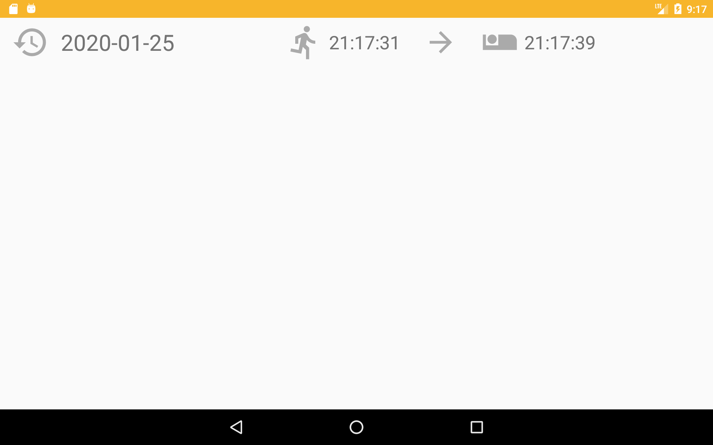

#  Lab Time Card 
LabTimeCard is management attendance app for lab members.  

# Features
| top |
| :---: |
|  |
| log |
|  |

# Credit
This project uses some modern Android libraries source codes.

* [Android Jetpack](https://developer.android.com/jetpack/) (Google)
  * Foundation
    * AppCompat
    * Android KTX
  * Architecture
    * Data Binding
    * Lifecycles
    * LiveData
  * UI
    * ConstraintLayout
    * RecyclerView
* [Firebase](https://firebase.google.com/) (Google)
  * RealTime Database
* [Material Components for Android](https://github.com/material-components/material-components-android) (Google)
* [Epoxy](https://github.com/airbnb/epoxy) (Airbnb)