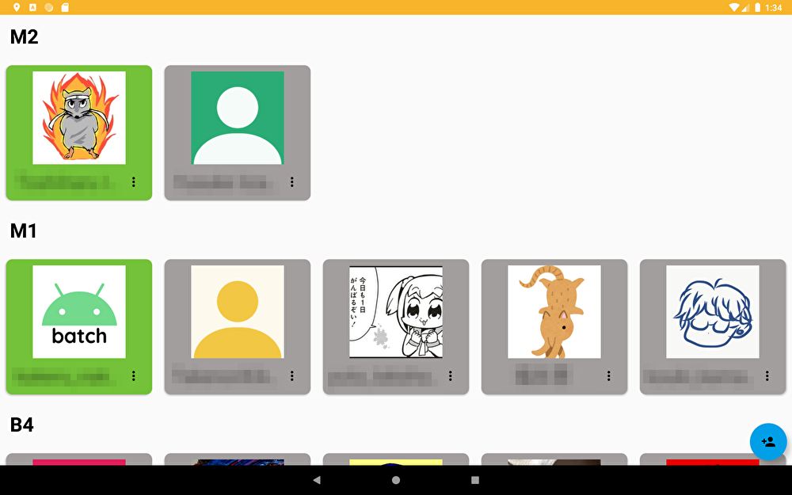

 

# LabTimeCard

LabTimeCard is management attendance app for lab members.  

# Features
| top |
| :---: |
|  |
| log |
|  |

## 運用
アプリがうまく動かなくなったときは、Slackとの連携がうまくいってない可能性が高いと思われます。
Slackとの通信の処理は `data/src/java/com/batch/labtimecard/data`あたりにソースファイルがあります。
エンドポイントなどは、apiディレクトリの中のKotlinファイルにソースコードがあります。

不明な点があれば、下記に問い合わせください  
batch: Twitter@b4tchkn  
thorn: Twitter@gericass

# Credit
This project uses some modern Android libraries source codes.

* [Android Jetpack](https://developer.android.com/jetpack/) (Google)
  * Foundation
    * AppCompat
    * Android KTX
  * Architecture
    * Data Binding
    * Lifecycles
    * LiveData
  * UI
    * ConstraintLayout
    * RecyclerView
* [Firebase](https://firebase.google.com/) (Google)
  * FirebaseUI
  * RealTime Database
* [Material Components for Android](https://github.com/material-components/material-components-android) (Google)
* [Epoxy](https://github.com/airbnb/epoxy) (Airbnb)
* [Timber](https://github.com/JakeWharton/timber) (JakeWharton)
* [Butter Knife](https://github.com/JakeWharton/butterknife) (JakeWharton)
* [ThreeTen Android Backport](https://github.com/JakeWharton/ThreeTenABP) (JakeWharton)
* [Koin](https://insert-koin.io/)
* [OkHttp](https://github.com/square/okhttp) (Square)
* [Retrofit](https://github.com/square/retrofit) (Square)
* [Moshi](https://github.com/square/moshi) (Square)
* [Stetho](https://github.com/facebook/stetho) (Facebook)
* [COIL](https://github.com/coil-kt/coil)
* [CalendarView](https://github.com/kizitonwose/CalendarView)
